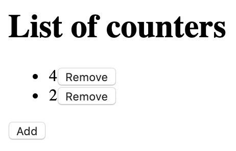

# Dynamic list state in redux-observable

At Unsplash we're big fans of Observables/RxJS, so naturally we opted for [redux-observable] inside our Redux application. However, quite quickly it started to feel like we were breaking away from idiomatic usage of redux-observable.

I believe our use cases are simple and common. By providing examples of the challenges we're facing, my hope is that either someone can point us to an existing idiomatic solution, or by sharing our ideas we can begin to establish an idiomatic solution.

## Setting the scene

Consider an application which uploads a files to a web server, with the following requirements:

- A button to add a new file (triggering the `AddFile` action). As soon as a file is added to the list, the request to upload it begins.
- A button to remove an existing file (triggering the `RemoveFile` action). As soon as a file is removed from the list, the upload request is cancelled.

In this article I'll be using a request to [HTTP bin](https://httpbin.org/) to simulate the upload, to keep the example simple.



## Redux state types

Each file will need its own state (a number representing the current value of the file).

```ts
type FileState = {
  id: string;
  isUploaded: boolean;
};
```

The root state will be a dictionary of our `FileState`s, indexed by their IDs:

```ts
type FileStates = {
  [id: string]: FileState;
};
type State = {
  fileStates: FileStates;
};
```

## Side effects and cancellation

_Somewhere, somehow_, we will need to trigger side effect _for each file in the list_, to perform the upload request.

Significantly, we also want to _support cancellation_: when a file is removed from the list, its corresponding [upload request must be aborted][abort]. This will help to save the user's data and provide confidentiality (maybe the user accidentally added the wrong file, and they don't want the file to continue uploading).

In this way, we can think of _each file in the list as having its own corresponding side effects_.

(These are the constraints we had when building the [uploader at Unsplash][uploader].)

## redux-observable

As we saw, cancellation is one of our requirements. Fortunately, Observables can provide us with that:

```ts
const request$ = ajax({ method: "put", url: "https://httpbin.org/put" });

// This will have the effect of calling `xhr.send`.
const subscription = request$.subscribe();

// This will have the effect of calling `xhr.abort`.
subscription.unsubscribe();
```

Note: we shouldn't need to call `unsubscribe` manually—we can instead use the [`takeUntil` operator](https://redux-observable.js.org/docs/recipes/Cancellation.html).

For this reason it seems to make sense to use [redux-observable].

Inside an [epic](https://redux-observable.js.org/docs/basics/Epics.html), we can declare our side effect (starting the interval). We can then map the response to our `FileUploaded` action.

```ts
ajax({ method: "put", url: "https://httpbin.org/put" }).pipe(
  mapTo(fileUploaded(fileId))
);
```

## The question

Using redux-observable, inside our epic, how can we _correspond_ a file in our list state to its side effects (the upload request)?

If we have a set of side effects for each file, intuitively it seems like we will need to instantiate an epic for each file (since side effects live inside epics). In turn, that would require some way of running multiple epics dynamically.

In idiomatic redux-observable, there is a way run multiple epics: [`combineEpics`](https://redux-observable.js.org/docs/api/combineEpics.html). However, `combineEpics` won't help in this case because it only works statically, but our list is dynamic (i.e. is not predefined and can grow or shrink in size at runtime).

## Potential solutions

### Re-using actions

Our epic could observe our existing `AddFile`/`RemoveFile` actions:

- When an `AddFile` action is received, we can run an Observable for the corresponding file (using `mergeMap`).
- When we receive a corresponding `RemoveFile` action for this file instance, we can unsubscribe from the Observable (using `takeUntil`). This would roughly look like the following:

```ts
const rootEpic: Epic<Action, State> = (action$, state$) => {
  const addFileAction$ = action$.pipe(filter(checkIsAddFileAction));
  const removeFileAction$ = action$.pipe(filter(checkIsRemoveFileAction));
  const fileAction$ = addFileAction$.pipe(
    // Run one Observable per file
    mergeMap(action => {
      const removeThisFileAction$ = removeFileAction$.pipe(
        filter(({ id }) => id === action.id)
      );
      return ajax({ method: "put", url: "https://httpbin.org/put" }).pipe(
        mapTo(fileUploaded(action.id)),
        // Dynamically unsubscribe from the Observable
        takeUntil(removeThisFileAction$)
      );
    })
  );
  return fileAction$;
};
```

Note: some minor details have been removed to simplify this example.

Full code: https://github.com/OliverJAsh/redux-observable-dynamic-list/blob/solution-reusing-actions/src/epics.ts

However, our `AddFile` action is _only a request_ to add a file. It doesn't tell us whether a file was actually added to the list state. For example, the reducer may have decided not to add the file, because the list has reached its maximum allowed size. Similarly, our `RemoveFile` action is also a request as opposed to a notification that the state changed in some way.

```ts
const MAXIMUM_ALLOWED_SIZE = 10;

const reducer: Reducer<State, Action> = (prevState = initialState, action) => {
  switch (action.type) {
    case ActionType.AddFile: {
      const fileStatesSize = Object.keys(prevState.fileStates);
      const canAddFile = fileStatesSize < MAXIMUM_ALLOWED_SIZE;
      if (canAddFile) {
        // Add file to list state
      } else {
        return prevState;
      }
    }
    // …
  }
};
```

Therefore what we really need is a way to know when a file was actually added to or removed from the list state.

### Watching the state

Another solution involves taking advantage of the `state$: Observable<State>` parameter inside our epic, observing the list state for additions/deletions.

- When a file is added to the list state, run an Observable for the corresponding file.
- When we observe a corresponding deletion of this file instance from the list state, we can unsubscribe from the Observable.

This is the solution we currently use. We've packaged this up into a function we call `runDictEpics` (dict is short for dictionary). Here it is in usage:

```ts
const fileEpic: Epic<Action, FileState> = (_action$, state$) =>
  ajax({ method: "put", url: "https://httpbin.org/put" }).pipe(
    mapTo(fileUploaded(state$.value.id))
  );

const rootEpic: Epic<Action, State> = (action$, state$) => {
  const fileAction$ = state$.pipe(
    map(state => state.fileStates),
    runDictEpics({
      action$,
      valueEpic: fileEpic,
      selectValue: id => fileStates => fileStates[id]
    })
  );
  return fileAction$;
};
```

Full code: https://github.com/OliverJAsh/redux-observable-dynamic-list/blob/solution-watching-state/src/epics.ts

Alternatively, we can watch the state for additions and deletions like above, and then map those to actions such as `AddedFile` and `RemovedFile` (respectively) and return/dispatch them in our epic. When the epic receives these actions, it can use them to decide when start/stop the Observables for each file.

```ts
const rootEpic: Epic<Action, State> = (action$, state$) => {
  const fileStatesAction$ = state$.pipe(
    map(state => state.fileStates),
    // Maps our list/dict state to actions representing additions/deletions.
    getDictStateChangeActions({
      createAddedAction: addedFile,
      createRemovedAction: removedFile
    })
  );

  const addedFileAction$ = action$.pipe(filter(checkIsAddedFileAction));
  const removedFileAction$ = action$.pipe(filter(checkIsRemovedFileAction));
  const fileAction$ = addedFileAction$.pipe(
    mergeMap(action => {
      const removedThisFileAction$ = removedFileAction$.pipe(
        filter(({ id }) => id === action.id)
      );
      return ajax({ method: "put", url: "https://httpbin.org/put" }).pipe(
        mapTo(fileUploaded(action.id)),
        // Dynamically unsubscribe from the Observable
        takeUntil(removedThisFileAction$)
      );
    })
  );

  return merge(fileStatesAction$, fileAction$);
};
```

Full code: https://github.com/OliverJAsh/redux-observable-dynamic-list/blob/solution-watching-state-emit-actions/src/epics.ts

If you're interested, there is a [discussion about this approach on GitHub](https://github.com/redux-observable/redux-observable/issues/562).

### Triggering actions when state changes

What if our reducer could send instructions for what should happen next? After all, the reducer knows exactly how the state changed, so it's best placed to know what should happen next, in relation to those state changes.

In this world, our reducer could _return an action_ as an instruction to begin the upload request.

```ts
const reducer: Reducer<State, Action> = (prevState = initialState, action) => {
  switch (action.type) {
    case ActionType.AddFile: {
      const updatedState = {
        /* … */
      };
      return {
        state: updatedState,
        actions: [startFileUpload()]
      };
    }
    case ActionType.RemoveFile: {
      const updatedState = {
        /* … */
      };
      return {
        state: updatedState,
        actions: [stopFileUpload()]
      };
    }
    // …
  }
};
```

Then our epic would just listen to these actions:

```ts
const rootEpic: Epic<Action, State> = (action$, state$) => {
  const startFileUploadAction$ = action$.pipe(
    filter(checkIsStartFileUploadAction)
  );
  const stopFileUploadAction$ = action$.pipe(
    filter(checkIsStopFileUploadAction)
  );
  const fileAction$ = startFileUploadAction$.pipe(
    // Run one Observable per file
    mergeMap(action => {
      const stopThisFileAction$ = stopFileUploadAction$.pipe(
        filter(({ id }) => id === action.id)
      );
      return ajax({ method: "put", url: "https://httpbin.org/put" }).pipe(
        mapTo(fileUploaded(action.id)),
        // Dynamically unsubscribe from the Observable
        takeUntil(stopThisFileAction$)
      );
    })
  );
  return fileAction$;
};
```

This is the solution I personally like most. It is also the way [Elm handles this][elm commands] (which is where the whole idea of Redux came from in the first place). It is perfectly possible to do this in Redux by writing a small store enhancer, which is what some of the existing libraries are doing, such as [redux-reducer-effects] and [redux-loop]. But, it breaks away from idiomatic Redux because it significantly changes the reducer signature, which is ultimately why we chose not to go with this approach at Unsplash.

If you're interested, there is a [discussion about this approach on GitHub](https://github.com/redux-observable/redux-observable/issues/563).

## After thoughts

Perhaps the reason there isn't an existing idiomatic solution for this is because redux-observable is agnostic towards its usage. After all, it's only there to connect the dots between Redux and RxJS, and Observables are primitives which can be used in all sorts of ways. That said, it would certainly benefit users of redux-observables if there were more examples of advanced (but common) patterns and how to use RxJS (not necessarily redux-observable) to solve them.

[redux-reducer-effects]: https://github.com/cubik-oss/redux-reducer-effects
[redux-loop]: https://github.com/redux-loop/redux-loop
[elm commands]: https://elmprogramming.com/commands.html
[redux-observable]: https://redux-observable.js.org/
[uploader]: https://medium.com/unsplash/building-the-unsplash-uploader-880a5ba0d442
[abort]: https://developer.mozilla.org/en-US/docs/Web/API/XMLHttpRequest/abort
