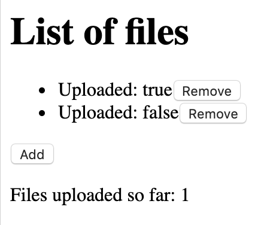

# TODO: title

At Unsplash we're big fans of Observables/RxJS, so naturally we opted for [redux-observable] inside our Redux application. However, it quite quickly started to feel like we were breaking away from idiomatic usage of redux-observable.

I believe our use cases are simple and common. By providing examples of the challenges we're facing, my hope is that either someone can point us to an existing idiomatic solution, or by sharing our ideas we can begin to establish an idiomatic solution.

The examples used in this article can be found in full length [on GitHub](https://github.com/OliverJAsh/redux-observable-dynamic-list).

## Setting the scene

Consider an application that displays a list of counters (counting upwards every 1 second), with a button to add a new counter (triggering the `AddCounter` action) or remove an existing one (triggering the `RemoveCounter` action).



## Redux state types

Each counter will need its own state (a number representing the current value of the counter).

```ts
type CounterState = {
  id: string;
  counter: number;
};
```

Therefore the root state will be a list/map/dictionary of our `CounterState`s:

```ts
type CounterStates = {
  [id: string]: CounterState;
};
type State = {
  counterStates: CounterStates;
};
```

## Side effects and cancellation

_Somewhere, somehow_, we will need to trigger a `setInterval` side effect _for each counter in the list_, to perform the counting.

Significantly, we also want to _support cancellation_: when a counter is removed from the list, its corresponding interval must be cleared via `clearInterval`.

In this way, we can think of _each counter in the list as having its own corresponding side effects_.

You might be thinking: surely it wouldn't be the end of the world if we didn't cancel/clear the interval, as long as the counter is removed from the UI? Whilst in this case that is true, in many other cases, cancellation _does_ matter. This article is just using a simple, contrived example for demonstration purposes. For example, if we were building a photo uploader with a list of photos, we would want to [abort the request](https://developer.mozilla.org/en-US/docs/Web/API/XMLHttpRequest/abort) to upload the photo when its removed from the list (to save the user's data and for confidentiality).

## redux-observable

As we saw, cancellation is one of our requirements. Fortunately, `Observable`s can provide us with that:

```ts
const interval$ = interval(1000);

// This will have the effect of calling `setInterval`.
const subscription = interval$.subscribe();

// This will have the effect of calling `clearInterval`.
subscription.unsubscribe();
```

Note: we shouldn't need to call `unsubscribe` manually—we can instead use the [`takeUntil` operator](https://redux-observable.js.org/docs/recipes/Cancellation.html).

For this reason it seems to make sense to use [redux-observable].

Inside an [epic](https://redux-observable.js.org/docs/basics/Epics.html), we can declare our side effect (starting the interval). We can then map each interval to our `IncrementCounter` action.

```ts
interval(1000).pipe(mapTo(incrementCounter(counterId)));
```

## The question

Using redux-observable, inside our epic, how can we _correspond_ a counter in our list state to a counter side effect (`setInterval`)?

In idiomatic redux-observable, there is a way run multiple epics: [`combineEpics`](https://redux-observable.js.org/docs/api/combineEpics.html). However, won't help in this case because `combineEpics` only works statically, but our list is dynamic (i.e. is not predefined and can grow or shrink in size at runtime).

## Potential solutions

### Re-using actions

Our epic could observe our existing `AddCounter`/`RemoveCounter` actions:

- When an `AddCounter` action is received, we can run a "child epic" for the corresponding counter (using `mergeMap`).
- When we receive a corresponding `RemoveCounter` action for this counter instance, we can unsubscribe from the "child epic" `Observable` (using `takeUntil`). This would roughly look like the following:

```ts
const counterEpic: Epic<Action, CounterState> = (_action$, state$) =>
  interval(1000).pipe(mapTo(incrementCounter(state$.value.id)));

const rootEpic: Epic<Action, State> = (action$, state$) => {
  const addCounterAction$ = action$.pipe(filter(checkIsAddCounterAction));
  const removeCounterAction$ = action$.pipe(filter(checkIsRemoveCounterAction));
  const counterAction$ = addCounterAction$.pipe(
    // Run one "child epic" per counter
    mergeMap(action => {
      const removeThisCounterAction$ = removeCounterAction$.pipe(
        filter(({ id }) => id === action.id)
      );
      const counterState$ = state$.pipe(
        map(state => state.counterStates[action.id])
      );
      return counterEpic(action$, counterStateObservable, {}).pipe(
        // Dynamically unsubscribe from the "child epic"
        takeUntil(removeThisCounterAction$)
      );
    })
  );
  return counterAction$;
};
```

Note: some minor details have been removed to simplify this example.

Full code: https://github.com/OliverJAsh/redux-observable-dynamic-list/blob/solution-reusing-actions/src/epics.ts

However, our `AddCounter` action is _only a request_ to add a counter. It doesn't tell us whether a counter was actually added to the list state. For example, the reducer may have decided not to add the counter, because the list has reached its maximum allowed size. Similarly, our `RemoveCounter` action is also a request as opposed to a notification that the state changed in some way.

```ts
const MAXIMUM_ALLOWED_SIZE = 10;

const reducer: Reducer<State, Action> = (prevState = initialState, action) => {
  switch (action.type) {
    case ActionType.AddCounter: {
      const counterStatesSize = Object.keys(prevState.counterStates);
      const canAddCounter = counterStatesSize < MAXIMUM_ALLOWED_SIZE;
      if (canAddCounter) {
        // Add counter to list state
      } else {
        return prevState;
      }
    }
    // …
  }
};
```

Therefore what we really need is a way to know when a counter was actually added to or removed from the list state.

### Watching the state

Another solution involves taking advantage of the `state$: Observable<State>` parameter inside our epic, observing the list state for additions/deletions.

- When a counter is added to the list state, run a "child epic" for the corresponding counter.
- When we observe a corresponding deletion of this counter instance from the list state, we can unsubscribe from the "child epic" `Observable`.

This is the solution we currently use. Behind the scenes it involves some rather complicated RxJS code to get it working, so we've packaged this up into a function we call `runListEpics`. Here it is in usage:

```ts
const rootEpic: Epic<Action, State> = (action$, state$) => {
  const counterAction$ = state$.pipe(
    map(state => state.counterStates),
    runListEpics({
      action$,
      listItemEpic: counterEpic,
      selectListItem: id => counterStates => counterStates[id]
    })
  );
  return counterAction$;
};
```

Full code: https://github.com/OliverJAsh/redux-observable-dynamic-list/blob/solution-watching-state/src/epics.ts

If you're interested, there is a [discussion about this approach on GitHub](https://github.com/redux-observable/redux-observable/issues/562).

### Triggering actions when state changes

What if our reducer could send instructions for what should happen next? After all, the reducer knows exactly how the state changed, so it's best placed to know what should happen next, in relation to those state changes.

In this world, our reducer could _return an action_ as an instruction to begin counting.

```ts
const reducer: Reducer<State, Action> = (prevState = initialState, action) => {
  switch (action.type) {
    case ActionType.AddCounter: {
      const updatedState = {
        /* … */
      };
      return {
        state: updatedState,
        actions: [startCounter()]
      };
    }
    case ActionType.RemoveCounter: {
      const updatedState = {
        /* … */
      };
      return {
        state: updatedState,
        actions: [stopCounter()]
      };
    }
    // …
  }
};
```

Then our epic would just listen to these actions:

```ts
const rootEpic: Epic<Action, State> = (action$, state$) => {
  const startCounterAction$ = action$.pipe(filter(checkIsStartCounterAction));
  const stopCounterAction$ = action$.pipe(filter(checkIsStopCounterAction));
  const counterAction$ = startCounterAction$.pipe(
    // Run one "child epic" per counter
    mergeMap(action => {
      const stopThisCounterAction$ = stopCounterAction$.pipe(
        filter(({ id }) => id === action.id)
      );
      const counterState$ = state$.pipe(
        map(state => state.counterStates[action.id])
      );
      return counterEpic(action$, counterStateObservable, {}).pipe(
        // Dynamically unsubscribe from the "child epic"
        takeUntil(stopThisCounterAction$)
      );
    })
  );
  return counterAction$;
};
```

This is the solution I personally like most. It is also the way [Elm handles this][elm commands] (which is where the whole idea of Redux came from in the first place). It is perfectly possible to do this in Redux by writing a small store enhancer, for example see [redux-reducer-effects] and [redux-loop]. But, it breaks away from idiomatic Redux, which is ultimately why we chose not to go with this approach at Unsplash.

If you're interested, there is a [discussion about this approach on GitHub](https://github.com/redux-observable/redux-observable/issues/563).

## After thoughts

Perhaps the reason there isn't an existing idiomatic solution for this is because redux-observable is agnostic towards its usage. After all, it's only there to connect the dots between Redux and RxJS, and Observables are primitives which can be used in all sorts of ways. That said, it would certainly benefit users of redux-observables if there were more examples of advanced (but common) patterns and how to use RxJS (not necessarily redux-observable) to solve them.

[redux-reducer-effects]: https://github.com/cubik-oss/redux-reducer-effects
[redux-loop]: https://github.com/redux-loop/redux-loop
[elm commands]: https://elmprogramming.com/commands.html
[redux-observable]: https://redux-observable.js.org/
